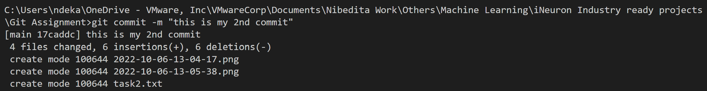

## 15 basic Github commands with explanation and screenshot
#### 1. git init  - this command initializes git repositories

#### 2. git status - this command checks whether the repositories have been updated and if the files are  tracked or not.

#### 3. git add "filename" or git add . - this command gets the files to be tracked. we can either add individual files one by one or we can use "add ." to track multiple files

#### 4. git commit -m "message" - this command pushes the file and changes to the statging environment and only these changes go to prod when we give the command for push

#### 5. git push  - this commans pushes the changes from stage to production environment and makes it available in git repositories

#### 6. git branch - this command shows all the brnaches available and also highlights the active branch that we are currently on

#### 7. git branch "name" - this command creates a new branch with name we provide 

#### 8. git checkout "name" - this command selects or makes the branch name we provide in the command as out current working branch

#### 9. git push origin "branch name"  - this command pushes the changes from the branch to production. it could be main or other branches like developer 1, developer 2 etc.. 

#### 10. git log - this command shows the logs of the multiple commits that were performed

#### 11. git merge  - command to merge other branches with main branch

#### 12. git pull  -

#### 13. git fetch

#### 14. git show

#### 15. git diff

#### 16. git rm

#### 17. git clone

#### 18. git help "command"

